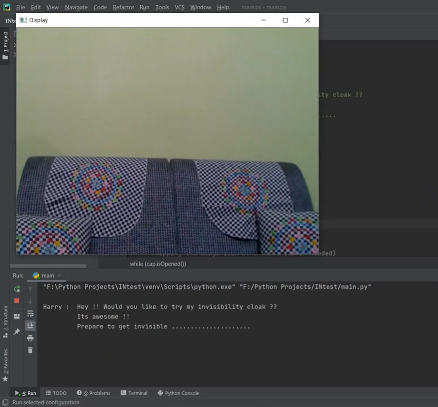
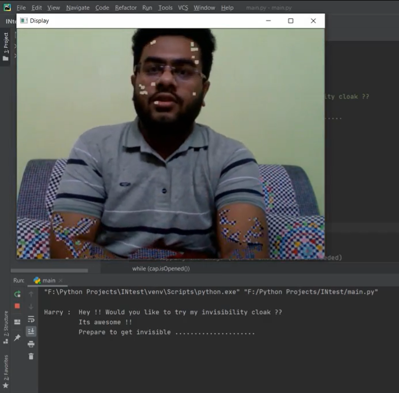
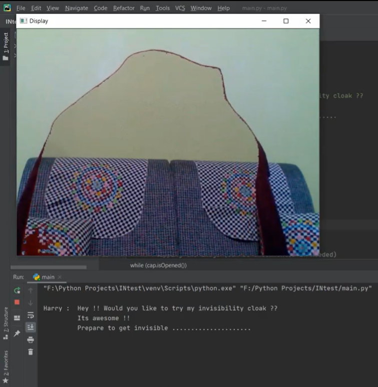

# Invisible-Cloak
This project is about the Cloak of Invisibility using the most popular library OpenCV and Python. I've used here red color cloak to invisible myself. You can run this program in your computer easily. To know more about the coding part you can watch from my youtube channel. 

# ScreenShots
After run the program, it'll take 3 seconds to take 20 snaps and the program will use the best snap.

Me without the red cloak.

Using the red cloak I invisible myslef.

